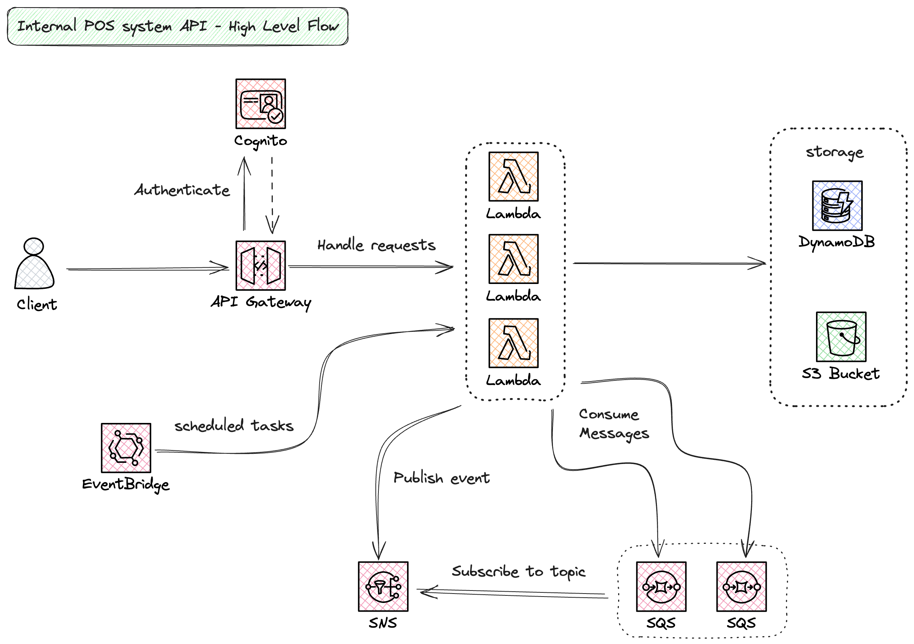

# internal-pos-system-api

## Overview

A cloud-based, serverless API for a multi-tenant Point of Sale (POS) system. The POS system is meant to be used internally within the vicinity of each tenant and main consumers are their employees.

> _ie. imagine a large company where it has its own cafeteria at different sites. The POS will be placed in those cafeteria and the employees are the buyers/consumers themselves. The employees use their "internal credit" to pay._

### Tech stack

- AWS Cognito (Auth)
- AWS API Gateway (Rest)
- AWS Lambda
- AWS DynamoDB (Datastore)
- AWS S3
- AWS EventBridge (Scheduled task / cron)
- AWS SNS/SQS

### Features

- Multi-tenant
- Employee Credit
  - To be used for checkout payment
  - Credit gets replenish every cutoff (semi-monthly / monthly)
- Checkout
- Misc / Admin
  - User / Employees
  - Menu
  - Concessionaire

## Design

### High Level Flow Diagram

### Database

The API is using **single-table** design pattern in DynamoDB.

**What is single-table design pattern in DynamoDB?**

- One single dynamoDB table.
- All entities will be stored into that one single table.
- Uses generic primary keys (partition key and sort key)

Basically, the API will only use one dynamoDB table which holds all of its different entities. To know more, I’d recommend looking into single-table design by Alex DeBrie

**Why single-table design?**

DynamoDB is known for being able handle requests at scale (if done well). It is due to the fact of how it (the tech itself) was built and designed in the hardware level (distributed and well partitioned).

The down side of DynamoDB, or any other no-sql DB, is the lack of joining capabilities. One way to do it is to make the data de-normalized but it will take more space and prone to stale data. Another way is to arrange the data by using multiple calls which ins't cost efficient since dynamoDB is pay per request. With Single-table design, it enables us to fetch data for multiple entities in one single call. _e.g. 1 call to fetch employee details along with its past 10 recent checkouts - these are with its own item (or row for relational DB) in the table_.
